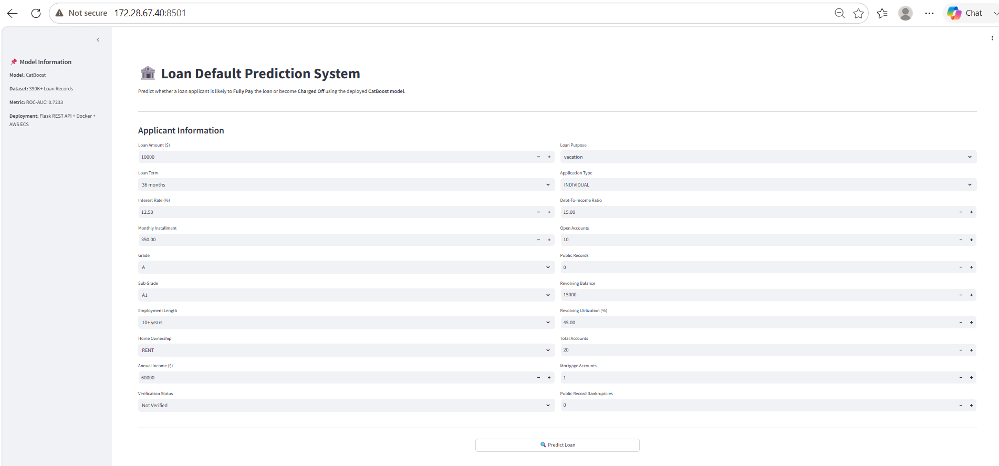
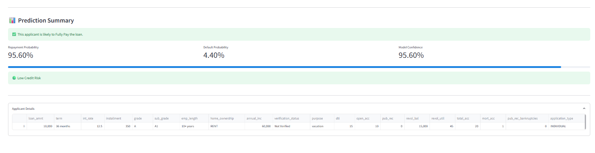
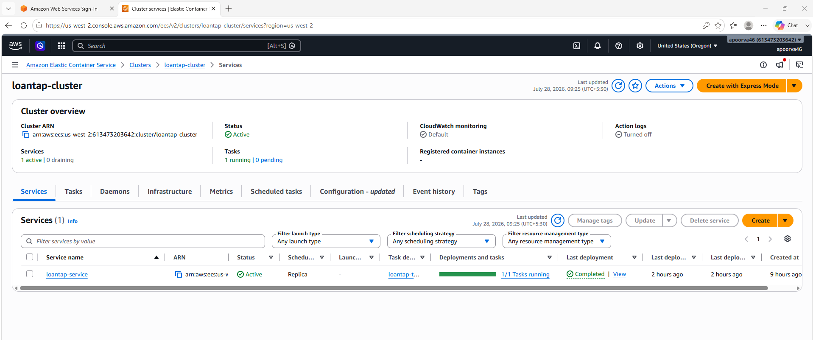
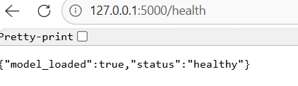
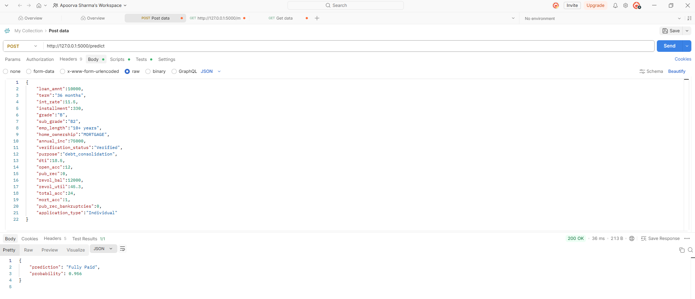

# 🚀 LoanTap Credit Risk Prediction using CatBoost | End-to-End MLOps Pipeline


---
🎯 Problem Type: Binary Classification

📊 Algorithm: CatBoost Classifier

☁️ Deployment: Amazon ECS (Fargate)

🐳 Containerization: Docker

🔄 CI/CD: GitHub Actions

🌐 API: Flask

💻 Frontend: Streamlit

# 📖 Project Overview

Loan default prediction is a critical problem in the banking and financial services industry. Financial institutions process thousands of loan applications every day, and approving loans for high-risk applicants can result in significant financial losses. An accurate credit risk prediction system helps lenders make informed decisions, reduce defaults, and improve the overall loan approval process.

This project presents an **End-to-End MLOps pipeline** that predicts whether a customer is likely to default on a loan using a **CatBoost Classifier**. The application provides predictions through both a **Flask REST API** and an interactive **Streamlit web application**. The complete solution is containerized using Docker, deployed on **Amazon ECS (Fargate)**, and continuously deployed using **GitHub Actions CI/CD**.

The project demonstrates the complete lifecycle of a production-ready Machine Learning application—from data preprocessing and model development to cloud deployment and automated CI/CD.

---

# 🎯 Business Problem

Financial institutions face significant challenges in identifying applicants who are likely to default on their loans.

Traditional manual underwriting can be:

- Time-consuming
- Error-prone
- Inconsistent
- Difficult to scale

An intelligent machine learning system can assist credit analysts by identifying high-risk applicants before loan approval.

### Business Objectives

- Predict the probability of loan default.
- Assist credit risk analysts in decision-making.
- Reduce financial losses caused by loan defaults.
- Improve operational efficiency through automation.
- Support data-driven lending decisions.

---

# ✨ Features

- ✅ End-to-End Machine Learning Pipeline
- ✅ Data Cleaning & Preprocessing
- ✅ Feature Engineering
- ✅ CatBoost Classification Model
- ✅ Model Serialization using Joblib
- ✅ Flask REST API
- ✅ Interactive Streamlit Web Application
- ✅ Docker Containerization
- ✅ Amazon Elastic Container Registry (ECR)
- ✅ Amazon Elastic Container Service (ECS Fargate)
- ✅ Automated CI/CD using GitHub Actions
- ✅ Health Check Endpoint
- ✅ REST Prediction Endpoint
- ✅ Production-Ready Deployment

---

# 🌟 Key Highlights

- Built a production-ready Credit Risk Prediction System.
- Deployed using Docker containers on Amazon ECS.
- Automated deployments using GitHub Actions.
- Exposed prediction services through REST APIs.
- Designed a user-friendly Streamlit interface.
- Demonstrates complete MLOps workflow from model training to production deployment.


---

# 🏗️ System Architecture

```mermaid
flowchart LR

A[Loan Applicant Data]
-->B[Data Preprocessing]

B-->C[Feature Engineering]

C-->D[CatBoost Model]

D-->E[Flask REST API]

E-->F[Docker Container]

F-->G[Amazon Elastic Container Registry (ECR)]

G-->H[Amazon ECS Fargate]

I[GitHub Repository]
-->J[GitHub Actions CI/CD]

J-->G

H-->K[Streamlit Application]

H-->L[REST API Consumers]
```

---

# ⚙️ Tech Stack

| Category | Technologies |
|------------|-------------------------------|
| Programming Language | Python |
| Data Processing | Pandas, NumPy |
| Machine Learning | CatBoost, Scikit-learn |
| API Development | Flask |
| Web Application | Streamlit |
| Model Serialization | Joblib |
| Containerization | Docker |
| Cloud Platform | AWS |
| Container Registry | Amazon ECR |
| Container Orchestration | Amazon ECS (Fargate) |
| CI/CD | GitHub Actions |
| Version Control | Git & GitHub |

---

# 📂 Project Structure

```text
LoanTap/
│
├── .github/
│   └── workflows/
│       └── deploy.yml              # GitHub Actions CI/CD Pipeline
│
├── app.py                          # Flask API
├── Dockerfile                      # Docker Configuration
├── requirements.txt
├── task-definition.json            # ECS Task Definition
├── README.md
│
├── src/                            # Source Code
├── models/                         # Saved ML Model
├── notebooks/                      # Model Development & EDA
├── deployment/                     # Deployment Scripts
├── config/
├── artifacts/
├── logs/
├── tests/
└── screenshots/
```

---

# 📊 Dataset Information

The dataset contains historical loan application records with customer demographic details, financial information, loan characteristics, and repayment status.

### Target Variable

- **loan_default**
  - **0** → Customer repaid the loan successfully.
  - **1** → Customer defaulted on the loan.

### Important Features

- Loan Amount
- Interest Rate
- Annual Income
- Debt-to-Income Ratio (DTI)
- Employment Length
- Home Ownership
- Loan Purpose
- Credit Grade
- Revolving Balance
- Public Records
- Open Credit Lines
- Credit Utilization
- Verification Status

---

# 🔄 Machine Learning Pipeline

The project follows a complete machine learning workflow from raw data ingestion to production deployment.

```text
Raw Dataset
      │
      ▼
Data Cleaning
      │
      ▼
Exploratory Data Analysis
      │
      ▼
Feature Engineering
      │
      ▼
Train-Test Split
      │
      ▼
Feature Scaling
      │
      ▼
Model Training
      │
      ▼
CatBoost Classifier
      │
      ▼
Model Evaluation
      │
      ▼
Model Serialization
      │
      ▼
Flask REST API
      │
      ▼
Docker Container
      │
      ▼
Amazon ECS Deployment
```

---

# 🤖 Machine Learning Model

The project uses the **CatBoost Classifier** for binary classification.

## Why CatBoost?

CatBoost was selected because it performs exceptionally well on structured tabular datasets and provides strong predictive performance with minimal preprocessing.

### Advantages

- Handles categorical features efficiently.
- Reduces overfitting through ordered boosting.
- Requires minimal feature preprocessing.
- Delivers high accuracy on tabular data.
- Robust against missing values.
- Fast training and inference.
- Excellent generalization performance.

---

# 📈 Model Development Workflow

The model development process included:

- Data Cleaning
- Missing Value Handling
- Feature Engineering
- Feature Scaling
- Model Training
- Model Evaluation
- Model Serialization using Joblib
- Production Deployment

The trained model is saved and loaded during inference to provide real-time loan default predictions through the deployed API and Streamlit application.


---

# 📊 Model Performance

Multiple machine learning algorithms were trained and evaluated to identify the most suitable model for loan default prediction.

The models compared include:

- Logistic Regression
- Decision Tree
- Random Forest
- Gradient Boosting
- XGBoost
- LightGBM
- CatBoost

The final model was selected based on **ROC-AUC**, which is an appropriate metric for evaluating binary classification problems with imbalanced datasets.

## Model Comparison

| Model | Accuracy | Precision | Recall | F1 Score | ROC-AUC |
|---------------------|---------:|----------:|--------:|---------:|---------:|
| Logistic Regression | 0.8058 | 0.8109 | 0.9890 | 0.8912 | 0.7109 |
| Decision Tree | 0.7083 | 0.8244 | 0.8095 | 0.8169 | 0.5515 |
| Random Forest | 0.8062 | 0.8150 | 0.9817 | 0.8906 | 0.7031 |
| Gradient Boosting | 0.8063 | 0.8118 | 0.9882 | 0.8913 | 0.7117 |
| XGBoost | 0.8055 | 0.8159 | 0.9789 | 0.8900 | 0.7191 |
| LightGBM | **0.8071** | 0.8133 | **0.9866** | **0.8916** | 0.7196 |
| **CatBoost (Final Model)** | 0.8068 | **0.8165** | 0.9799 | 0.8908 | **0.7233** |

---

## Final Model

The **CatBoost Classifier** was selected as the final production model because it achieved the highest **ROC-AUC score of 0.7233**, indicating the strongest ability to distinguish between loan defaulters and non-defaulters.

### Evaluation Metrics (CatBoost)

| Metric | Score |
|---------|------:|
| Accuracy | 80.68% |
| Precision | 81.65% |
| Recall | 97.99% |
| F1 Score | 89.08% |
| ROC-AUC | 72.33% |

---

## Why ROC-AUC?

Since the dataset is **imbalanced**, relying solely on accuracy can be misleading. ROC-AUC measures how well the model separates the two classes across different classification thresholds, making it a more reliable metric for model selection in credit risk prediction.

### Evaluation Metrics

- **Accuracy** measures the overall correctness of the model.
- **Precision** indicates how many predicted defaults were actually defaults.
- **Recall** measures how effectively the model identifies actual loan defaulters.
- **F1-Score** balances Precision and Recall.
- **ROC-AUC** evaluates the model's ability to distinguish between default and non-default applicants.

---

# 🌐 REST API

The trained model is exposed through a Flask REST API for real-time inference.

## Available Endpoints

| Method | Endpoint | Description |
|---------|----------|-------------|
| GET | `/` | Home Endpoint |
| GET | `/health` | Health Check |
| POST | `/predict` | Predict Loan Default |

---

## Health Check

Request

```http
GET /health
```

Example Response

```json
{
    "status": "healthy"
}
```

---

## Prediction Endpoint

Request

```http
POST /predict
```

Example JSON Request

```json
{
    "loan_amnt": 12000,
    "int_rate": 11.5,
    "annual_inc": 85000,
    "dti": 14.2,
    "emp_length": 5
}
```

Example Response

```json
{
    "prediction": "No Default"
}
```

> Replace the above request with the exact features accepted by your API if they differ.

---

# 💻 Streamlit Web Application

The project includes an interactive Streamlit dashboard that enables users to obtain loan default predictions without writing any code.

### Features

- User-friendly interface
- Real-time predictions
- Interactive form inputs
- Displays prediction results instantly
- Suitable for demonstration and business users

---

## Application Workflow

```text
User Inputs Loan Details

↓

Click Predict

↓

Input Validation

↓

Load Trained CatBoost Model

↓

Generate Prediction

↓

Display Loan Default Result
```

---

# 🐳 Docker Containerization

To ensure portability and reproducibility, the application is containerized using Docker.

### Build Docker Image

```bash
docker build -t loantap-api .
```

### Run Docker Container

```bash
docker run -p 5000:5000 loantap-api
```

### Benefits

- Consistent runtime environment
- Easy deployment
- Platform independent
- Simplified dependency management

---

# ☁️ AWS Cloud Deployment

The application is deployed on **Amazon Elastic Container Service (Amazon ECS)** using **AWS Fargate**.

The deployment workflow includes:

- Building the Docker image
- Pushing the image to Amazon Elastic Container Registry (ECR)
- Deploying the latest image to Amazon ECS
- Serving predictions through the Flask REST API

---

## AWS Services Used

| AWS Service | Purpose |
|--------------|------------------------------|
| Amazon ECR | Stores Docker Images |
| Amazon ECS | Runs Docker Containers |
| AWS Fargate | Serverless Container Hosting |
| IAM | Access Management |

---

# 🔄 CI/CD Pipeline

The project uses **GitHub Actions** to automate the deployment pipeline.

## Workflow

```text
Developer Pushes Code

↓

GitHub Repository

↓

GitHub Actions

↓

Build Docker Image

↓

Push Image to Amazon ECR

↓

Update ECS Task Definition

↓

Deploy Latest Container

↓

Application Available on ECS
```

### Benefits

- Fully automated deployment
- Faster release cycle
- Reduced manual effort
- Improved deployment consistency
- Easy rollback capability

---

# 📷 Project Demonstration

> Add screenshots in the `screenshots/` folder and reference them below.

### Streamlit Home



---

### Prediction Result



---

### Docker Container


---

### Amazon ECS Deployment



---

### Amazon ECR Repository


---

### GitHub Actions CI/CD


---

### Flask API


---

### Health Endpoint



---

### Postman Prediction




---

# ⚡ Installation

Follow the steps below to set up the project locally.

## 1. Clone the Repository

```bash
git clone https://github.com/apoorva46/LoanTap.git
```

## 2. Navigate to the Project Directory

```bash
cd LoanTap
```

## 3. Create a Virtual Environment (Optional)

### Windows

```bash
python -m venv venv
venv\Scripts\activate
```

### Linux / macOS

```bash
python3 -m venv venv
source venv/bin/activate
```

---

## 4. Install Dependencies

```bash
pip install -r requirements.txt
```

---

# ▶️ Running the Application

## Start the Flask API

```bash
python app.py
```

The API will be available at:

```
http://localhost:5000
```

---

## Run the Streamlit Application

```bash
streamlit run streamlit_app.py
```

The Streamlit application will open in your browser.

---

# 🐳 Running with Docker

## Build the Docker Image

```bash
docker build -t loantap-api .
```

## Run the Docker Container

```bash
docker run -p 5000:5000 loantap-api
```

---

# 🧪 Testing the API

You can test the API using:

- Postman
- cURL
- Swagger (if implemented)

### Health Check

```http
GET /health
```

Expected Response

```json
{
  "status":"healthy"
}
```

---

### Prediction Endpoint

```http
POST /predict
```

Example Request

```json
{
    "loan_amnt":12000,
    "int_rate":11.5,
    "annual_inc":85000,
    "dti":14.2,
    "emp_length":5
}
```

Example Response

```json
{
    "prediction":"No Default"
}
```

---

# 📌 Challenges Faced

During the development of this project, several real-world MLOps challenges were encountered and resolved.

- Configuring Docker for containerized deployment
- Managing Python dependencies across environments
- Deploying Docker images to Amazon ECR
- Configuring Amazon ECS services and task definitions
- Setting up IAM permissions
- Automating deployments using GitHub Actions
- Debugging CI/CD workflow failures
- Managing model serialization and inference

These challenges provided practical experience in deploying and maintaining production-ready machine learning systems.

---

# 🚀 Future Improvements

The current implementation serves as a production-ready machine learning application. Future enhancements may include:

- MLflow for experiment tracking
- Model Registry
- Evidently AI for model monitoring
- Automated model retraining
- Kubernetes deployment
- Terraform for Infrastructure as Code
- CloudWatch monitoring
- API authentication using JWT
- Load balancing with Application Load Balancer
- Auto Scaling for ECS services
- Model versioning
- Drift detection
- Feature Store integration

---

# 💡 Key Learnings

Through this project, I gained practical experience in:

- End-to-End Machine Learning Pipeline Development
- Credit Risk Modeling
- Feature Engineering
- CatBoost Model Training
- Flask REST API Development
- Streamlit Application Development
- Docker Containerization
- Amazon ECR
- Amazon ECS Deployment
- GitHub Actions CI/CD
- Production Model Deployment
- Machine Learning System Design
- MLOps Best Practices

---

# 👨‍💻 Author

**Apoorva Sharma**

Data Scientist | Machine Learning Engineer | MLOps Enthusiast

GitHub

https://github.com/apoorva46

LinkedIn

https://www.linkedin.com/in/apoorva10/

---

# 🙏 Acknowledgements

Special thanks to:

- LoanTap dataset contributors- Scaler Academy
- Open-source Python community
- Scikit-learn
- CatBoost
- Flask
- Streamlit
- Docker
- Amazon Web Services
- GitHub Actions

---

# ⭐ If you found this project useful...

If you found this repository helpful, consider giving it a ⭐ on GitHub.

It helps others discover the project and motivates future improvements.

---

## 📄 License

This project is licensed under the MIT License.

Feel free to use and modify it for learning purposes.
